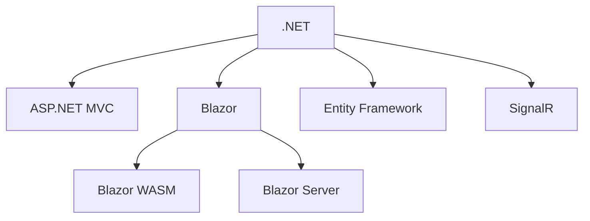
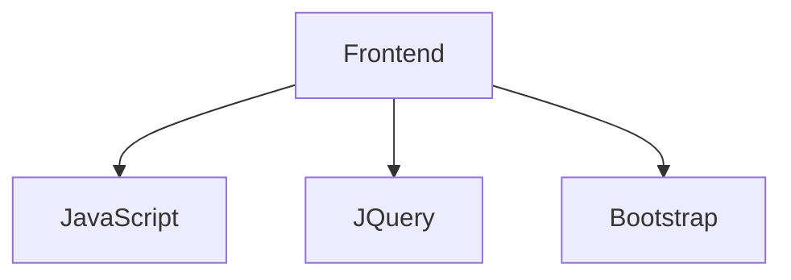
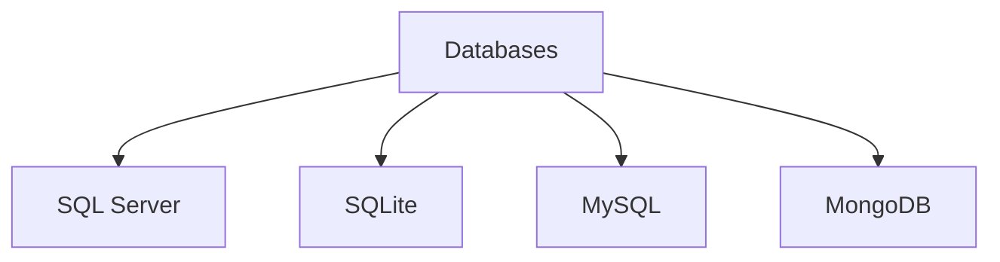
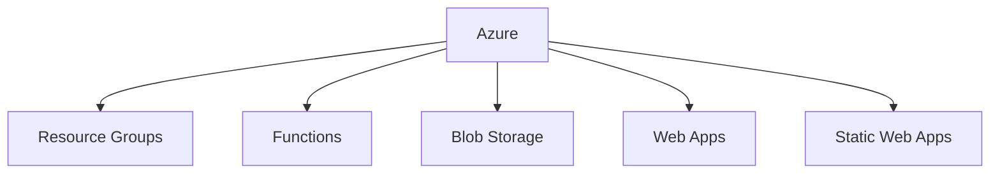

# 🧠 Tech Stack — Chris Baker

> Passionate Full Stack Developer focused on .NET technologies, Blazor, modern web tooling, and cloud-based architecture.  
> Always learning. Always building. ╭(◕◕ ◉෴◉ ◕◕)╮

---

## ✅ Languages & Frameworks

- [x] **.NET / ASP.NET**
- [x] **Blazor (WASM / Server)**
- [x] **MVC (ASP.NET Core)**
- [x] **JavaScript / JQuery**
- [x] **Bootstrap**

---

## 🛠️ Databases

- [x] **SQL Server (SSMS)**
- [x] **SQLite**
- [x] **MySQL**
- [x] **MongoDB**

---

## ☁️ Cloud & DevOps

- [x] **Azure**  
  - Resource Groups  
  - Functions  
  - Blob Storage  
  - Web Apps  
  - Static Web Apps

---

## 📊 My Stack

### 🧩 .NET Ecosystem

### 🎨 Frontend Tech

### 🧱 Databases

### ☁️ Azure Cloud Services

